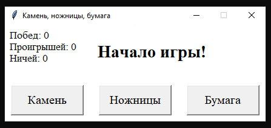
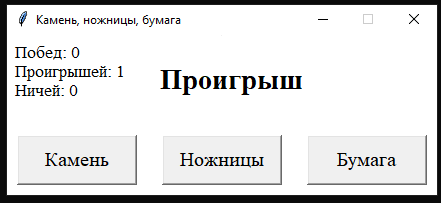
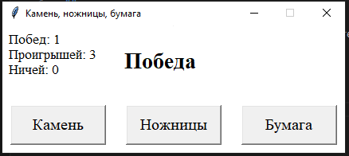
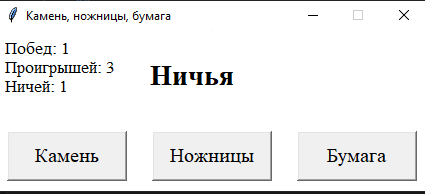

# Камень Ножницы Бумага
## описание 
Этот проект представляет собой простую игру "Камень, ножницы, бумага", написанную на Python
## установка
требуется Pythonv2024.22.0
```bash
git clone git@github.com:lizka221/-.-.git
python3 -m pip install pygame
python3 -m venv path/to/venv
source path/to/venv/bin/activate
python3 -m pip install pygame
python3 'play module.py'
```
## правила 
В появившемся окне выберите вариант, который хоитете использовать (камень, ножницы или бумага) и нажмите на кнопку с этим вариантом. По середине окна появится итог игры вас с компьютером.
## управление 
Все управленипе происходит при помощи мыши. Наведите курсор на нужную вам кнопку и щелкните по нему правой кнопкой мыши.
## скриншоты
)



